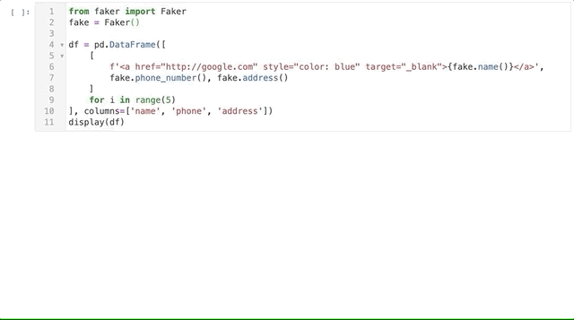
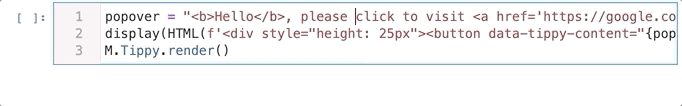
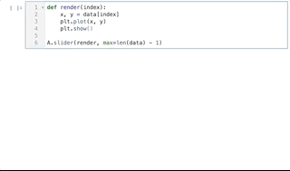
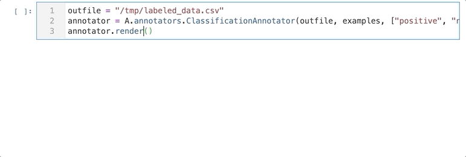

<h1 align="center">labext</h1>

<div align="center">


[](https://github.com/binh-vu/labext/issues)

[](https://opensource.org/licenses/MIT)

</div>

## Overview

This library provides pre-built widgets and integrates some additional JS libraries to provide an even better experience to work with data in Jupyter Lab.

Features:
1. Better display for pandas data frame.
2. Pop-over content, allowing to show additional content when hovering over a DOM element. 
3. Widgets for interactive labeling/annotating data in Jupyter Lab. 

## Usage

See the [Demo](./demo.ipynb) notebook for how to use the library. Demo:

1. Converting DataFrame to DataTable
<br/>

2. Pop-over (Tippy)
<br/>

3. Slider
<br/>

4. Annotator 
<br/>


## Installation

### Docker

I provide a [Dockerfile](./Dockerfile) that create a base environment to run this library. To run the [demo](./demo.ipynb) notebook in docker, you can use [docker-compose](./docker-compose.yml) to start a jupyter lab:
```bash
docker-compose up
``` 

### Manual
To use this with JupyterLab, you need to have `requirejs` enable in Jupyter by installing either:

1. https://github.com/DraTeots/jupyterlab_requirejs (jupyterlab version <= 1.*)
2. https://github.com/binh-vu/jupyterlab_requirejs  (jupyterlab version >= 2.*)

Beside `requirejs`, you also need to have `ipywidgets`, `ipyevents`, `ipycallback`

```bash
pip install ipywidgets ipyevents ipycallback
jupyter nbextension enable --py widgetsnbextension
jupyter nbextension enable --py --sys-prefix ipyevents
jupyter labextension install @jupyter-widgets/jupyterlab-manager ipyevents ipycallback
```

Finally, install this package directly from `pypi`:

```bash
pip install -U labext
``` 

## Development

To compile the typescript files you need to install:

```bash
npm install @types/jquery
```

Then compiles all `.ts` files, remove`--watch` if you don't want to monitor for changes.

```bash
tsc --target es2017 --watch **/*.ts
```
